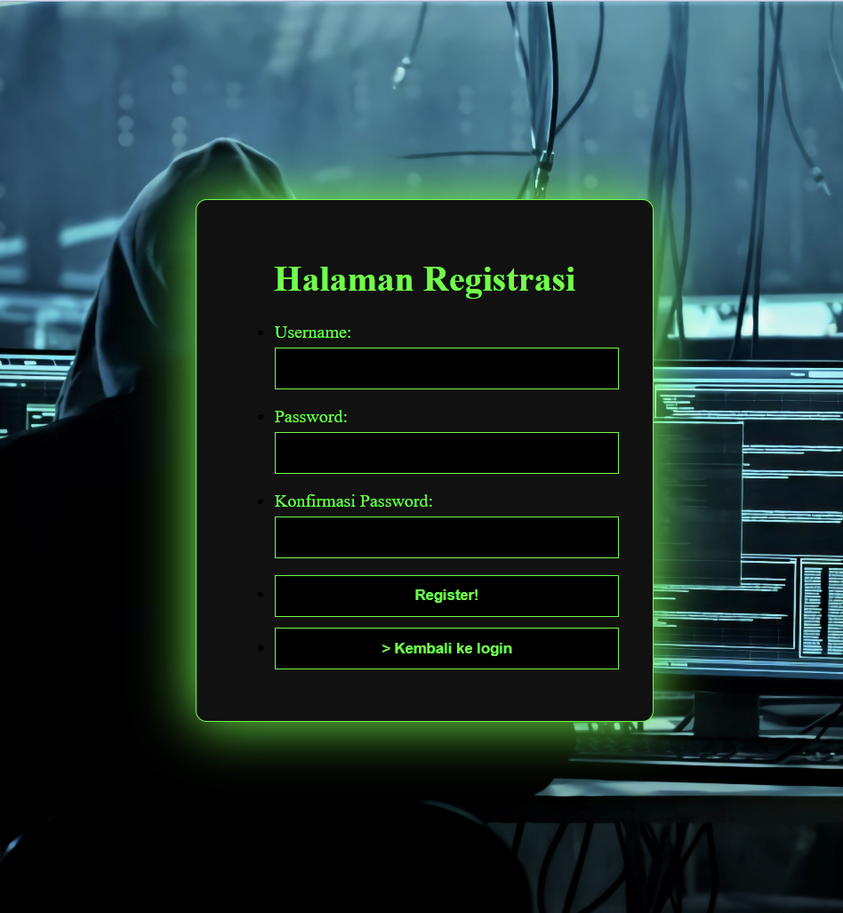
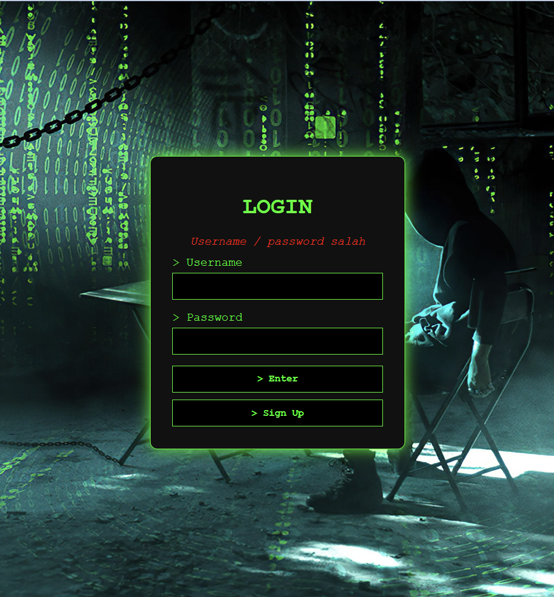
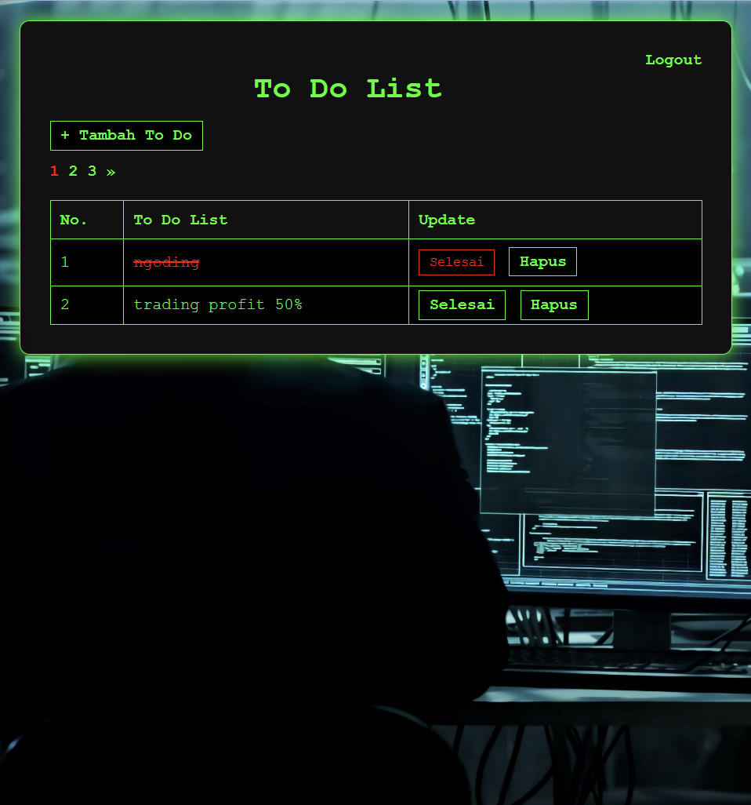
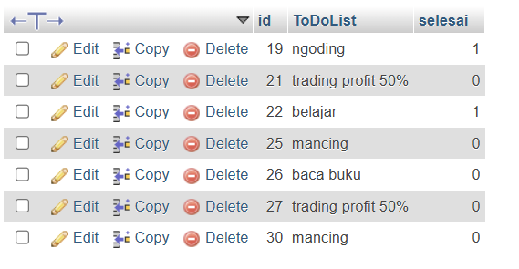
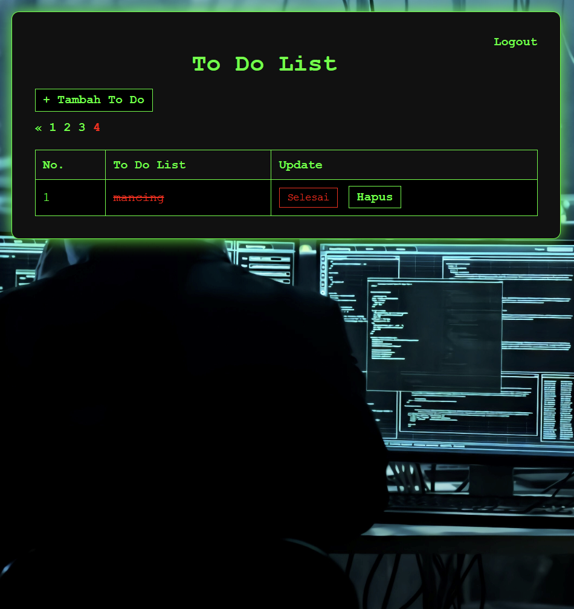
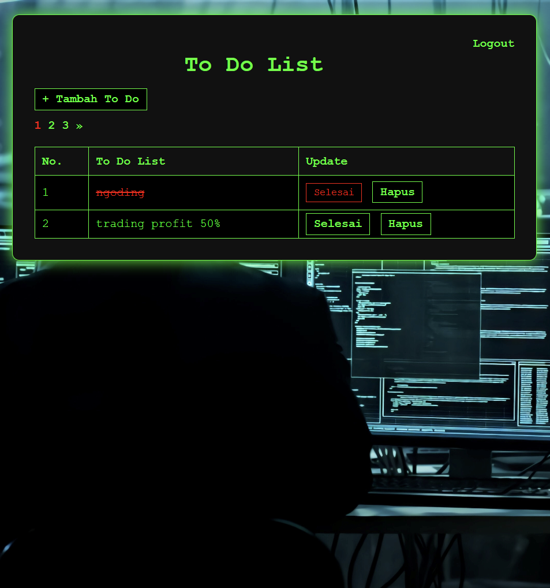
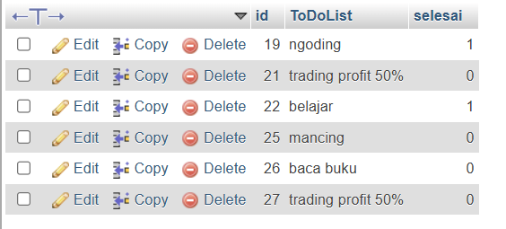
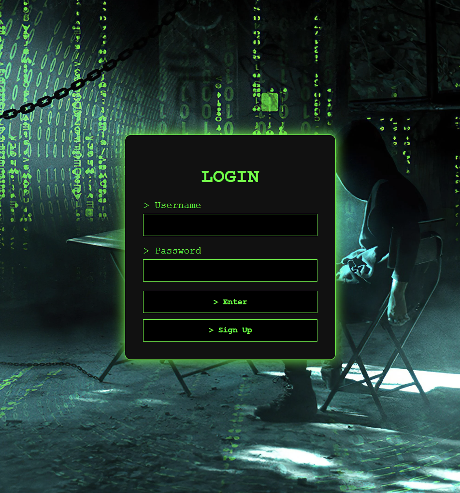

# ToDoList

## 1. Login

Pada gambar di atas, ditampilkan halaman login yang menampilkan username & password, tombol enter & sign-up

## 2. Registrasi
Ketika tombol sign-up ditekan maka akan muncul halaman registrasi seperti gambar dibawah ini. dan akan kembali ke halaman login

## 3. Login Salah
jika username/password salah maka akan tampil pesan username/password salah

## 4. Login berhasil
ketika login berhasil maka akan ke halaman utama (kelas index)

## 5. Tambah to do List
ketika tombol + tambah to do diklik maka akan pergi ke halaman toDoList seperti pada gambar dibawah

## 6. to do list ditambahkan
ketika tombol tambah di klok, maka to do list baru ditambahkan ke dataset dan akan tampil di halaman utama seperti pada gambar dibawah. tetapi jika tombol kembali di klik maka akan kembali ke halaman utama tanpa menambahkan data.

## 7. Selesai
ketika tombol selesai ditambahkan maka data pada tabel halaman utama akan dicoret dan berwarna merah menandakan bahwa data tersebut sudah selesai dilaksanakan.

## 8. hapus
jika tombol hapus diklik maka data tersebut akan hilang dari halaman utama dan dataset.

terlihat pada gambar diatas, pagination yang tadinya 4 sekarang sudah 3

terlihat pada gambar diataas, yang tadinya ada data mancing paling akhir, sekarang sudah tidak ada

## 9. logout
jika tombol logout pada halaman utama diklik maka halaman utama akan ditutup dan kembali ke halaman login. sebelum login, user tidak dapat masuk ke halaman lainnya
